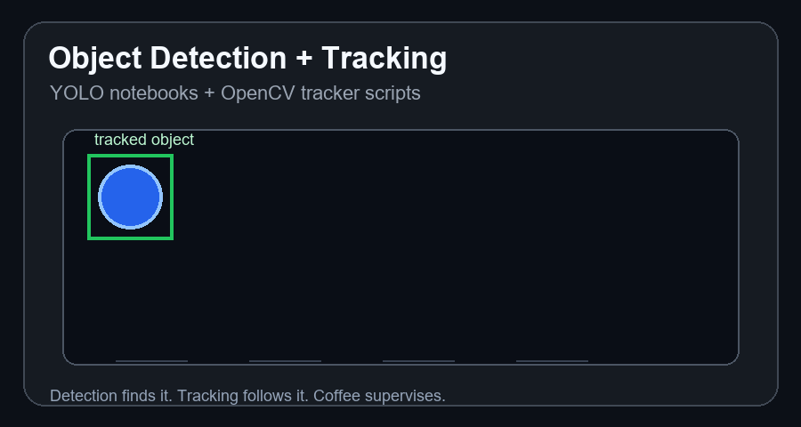
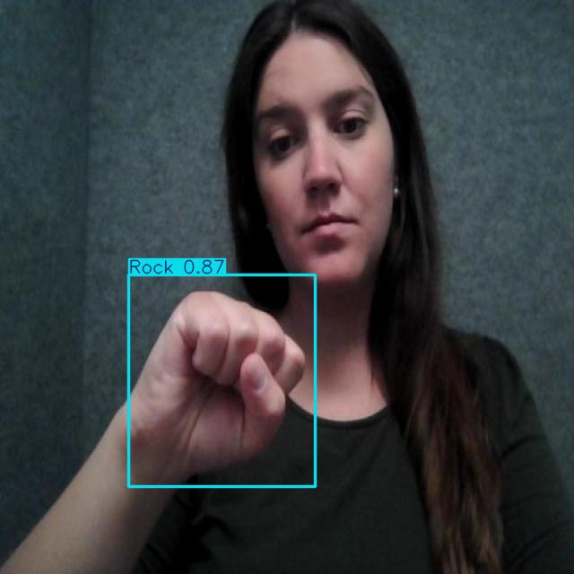

# Object Detection And Tracking

One-line version: a combined computer vision repo for YOLOv11 object detection practice and OpenCV object tracking experiments.

<p align="center">
  
  
  
  
  
  
</p>

<p align="center">
  
</p>

## What It Does

This repo keeps two related computer vision practice areas together:

- object detection with YOLOv11 notebooks
- object tracking with OpenCV tracker scripts

Useful because detection answers "what is in the frame?" and tracking answers "where did it go next?" Basically, the camera version of keeping an eye on things without looking suspicious.

## Practice Preview

<p align="center">
  
</p>

## Topics And Files

| Topic | File |
| --- | --- |
| Getting started with YOLOv11 object detection | `notebooks/object_detection/Getting_Started_with_Yolov11__Object_Detection.ipynb` |
| Custom dataset training with YOLOv11 | `notebooks/object_detection/Custom_Dataset_Training_with_YOLOv11.ipynb` |
| BOOSTING tracker | `tracking/opencv_trackers/boosting.py` |
| CSRT tracker | `tracking/opencv_trackers/csrt.py` |
| GOTURN tracker script | `tracking/opencv_trackers/goturn.py` |
| KCF tracker | `tracking/opencv_trackers/kcf.py` |
| MEDIANFLOW tracker | `tracking/opencv_trackers/medianflow.py` |
| MIL tracker | `tracking/opencv_trackers/mil.py` |
| MOSSE tracker | `tracking/opencv_trackers/mosse.py` |
| TLD tracker | `tracking/opencv_trackers/tld.py` |

## Quick Start

```bash
pip install -r tracking/opencv_trackers/requirements.txt
pip install ultralytics jupyter
jupyter notebook
```

Open the YOLO notebooks from `notebooks/object_detection/`.

For tracking scripts, run one of the OpenCV tracker files:

```bash
python tracking/opencv_trackers/kcf.py
```

Some trackers may need OpenCV contrib support. If OpenCV complains, it is probably asking for `opencv-contrib-python`, not emotional support. Though honestly, both help.

## Links

- Repo: https://github.com/Siddharth-k7/Object-detection-and-tracking
- Ultralytics docs: https://docs.ultralytics.com/
- OpenCV tracking docs: https://docs.opencv.org/
- Live demo: not hosted; the notebooks and README preview show the practice outputs.

