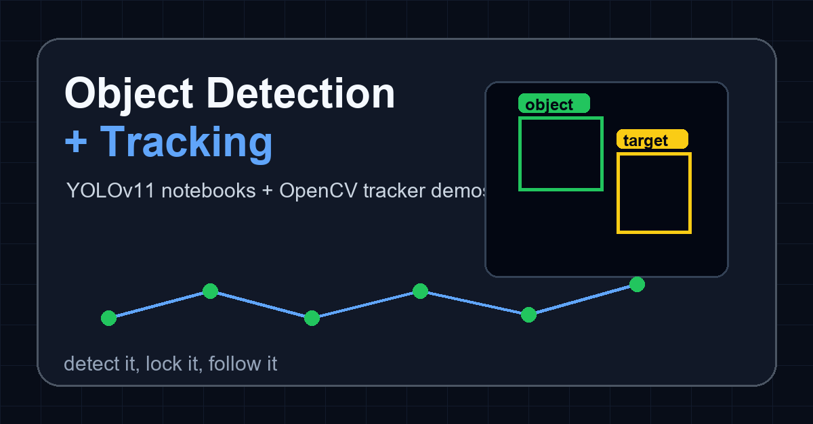

# Object Detection And Tracking

One-line version: YOLOv11 object detection notebooks plus OpenCV tracking demos in one clean computer vision repo.

<p align="center">
  
</p>

<p align="center">
  <a href="https://github.com/Siddharth-k7/Object-detection-and-tracking/actions/workflows/ci.yml">
    
  </a>
  
  
  
  
</p>

<p align="center">
  
  
  
  
  
</p>

## What It Does

This repo combines two things that usually work together:

- **Object detection**: YOLOv11 notebooks for finding objects in images.
- **Object tracking**: OpenCV scripts for following a selected object frame by frame.

It is useful as a learning and showcase repo because it shows both sides of the workflow: first detect the object, then track where it goes. A camera sees chaos; this repo tries to give it a job description.

## Demo Preview

<p align="center">
  
</p>

<p align="center">
  
</p>

## Quick Start

Clone the repo:

```bash
git clone https://github.com/Siddharth-k7/Object-detection-and-tracking.git
cd Object-detection-and-tracking
```

Install the basics:

```bash
pip install -r tracking/opencv_trackers/requirements.txt
pip install ultralytics jupyter
```

Open the notebooks:

```bash
jupyter notebook
```

Run a tracker demo:

```bash
python tracking/opencv_trackers/kcf.py
```

Some trackers need `opencv-contrib-python`, which is already listed in the tracking requirements. If OpenCV complains anyway, it is doing its traditional warm-up routine.

## Repo Structure

```text
.
├── assets/                       # banner, GIF, and notebook preview images
├── docs/                         # extra project notes
├── notebooks/object_detection/   # YOLOv11 detection notebooks
├── tests/                        # lightweight repository tests
├── tracking/opencv_trackers/     # OpenCV tracker demos
├── .github/workflows/ci.yml      # CI for compile checks and tests
├── CHANGELOG.md
├── CONTRIBUTING.md
├── LICENSE.md
└── README.md
```

## Topics And Files

| Topic | File |
| --- | --- |
| Getting started with YOLOv11 object detection | `notebooks/object_detection/Getting_Started_with_Yolov11__Object_Detection.ipynb` |
| Custom dataset training with YOLOv11 | `notebooks/object_detection/Custom_Dataset_Training_with_YOLOv11.ipynb` |
| BOOSTING tracker | `tracking/opencv_trackers/boosting.py` |
| CSRT tracker | `tracking/opencv_trackers/csrt.py` |
| GOTURN tracker script | `tracking/opencv_trackers/goturn.py` |
| KCF tracker | `tracking/opencv_trackers/kcf.py` |
| MEDIANFLOW tracker | `tracking/opencv_trackers/medianflow.py` |
| MIL tracker | `tracking/opencv_trackers/mil.py` |
| MOSSE tracker | `tracking/opencv_trackers/mosse.py` |
| TLD tracker | `tracking/opencv_trackers/tld.py` |

## Quality Signals

- GitHub Actions CI runs on pushes and pull requests.
- Tests check the repo structure and guard against accidentally committed huge files.
- Tracking scripts are compiled in CI.
- Large model weights, virtual environments, cache files, and temporary files are ignored.
- Version starts at `v0.1.0`; changes are tracked in `CHANGELOG.md`.

## Links

- Repo: https://github.com/Siddharth-k7/Object-detection-and-tracking
- Docs: [docs/overview.md](docs/overview.md)
- Ultralytics docs: https://docs.ultralytics.com/
- OpenCV docs: https://docs.opencv.org/
- API docs: not hosted yet; this repo is notebook/script based.
- Live demo: not hosted; the GIF and notebook output above are the visual demo.

## License

MIT License. See [LICENSE.md](LICENSE.md).

